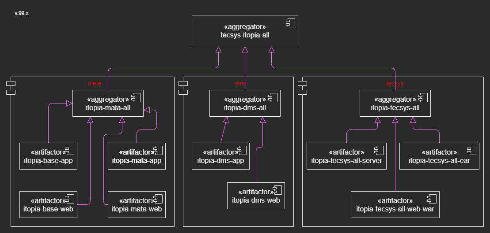

# Updating Version Numbers 

## Maven CI Friendly Versions

### CI Friendly Maven Project Structure for v99x - Make tecsys-all a Parent BOM

|  |
| --- |

### CI Friendly Maven Project Structure for v99x - New Parent BOM

|  |
| --- |

### CI Friendly Maven Project Structure for v2021.1+

|  |
| --- |


``` 
mvn clean package -Drevision=francois-2021.04-SNAPSHOT
```

``` 
mvn clean package -Drevision=francois-99x-SNAPSHOT
```